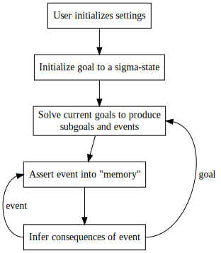
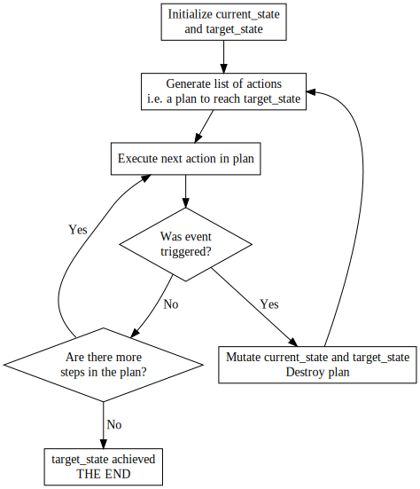

# TALE-SPIN
TALE-SPIN 是 James R. Meehan 于 1977 年开发的人工智能程序。它通过使用行动的知识库来解决和修改目标。在执行操作时，它们会输出构成故事的文本。用作者的话来说：

>TALE-SPIN 是一个自上而下和目标导向的问题解决者。它的输出可以看作是解决问题过程的痕迹。

Meehan 拒绝了以前使用干净公式的方法，这些方法涉及定义“一种”知识，但有时会导致奇怪的故事。相反，他定义并整合了多种知识来创造更自然的故事。

类似地，目标跟踪系统开始时只是一堆目标，但逐渐变得复杂起来：
* 重复的目标
* 为每个角色分别设定目标
* 推理步骤中的永久目标状态，例如自我保护
* 识别目标
    * 被取代了
    * 可以被安全地抛弃
    * 应该根据新的信息退休

这是 TALE-SPIN 的一个高级流程图。这里有一些有趣的地方需要注意:

* 每个故事都以一个单一的sigma-state——饥饿、口渴、休息、性——作为目标开始。
* Meehan 使用术语“计划箱”来指代完成目标必须满足的先决条件、子目标（又名行动）、后置条件和后行动的列表。考虑到这一点，我们可以看到解决初始sigma-state目标如何导致子目标激增。
* 推理机制负责捕获复杂的级联交互，例如我饿了，向鲍比要食物。鲍比通过告诉我在哪里可以找到蜂箱作为回答。蜂箱不是食物，但可以通过挖出里面的蜂蜜来获得食物。

Meehan 定义了六种目标。这些目标通过包含其他目标的“计划箱”定义来封装对世界的认识，例如，盗窃的前提条件是与受害者有一定的个性和关系。

|名称|顶级目标|前提条件|子目标|后置条件|后置行动|Primitives|例子|
|-|-|-|-|-|-|-|-|
|三角洲行动|✓|✓|✓|✓|✓|不适用|三角洲控制|
|说服|✓|✓|✓|✓|✓|不适用|请求、提议、讨价还价、威胁|
|sigma状态|✓|✓||✓|✓|饥饿，口渴，休息，性||
|人际关系||✓|✓|✓||竞争、支配、熟悉、喜爱、信任、欺骗、欠债||
|性格||✓||✓||善良，虚荣，诚实，智慧||
|地图||✓||✓||||

# TALE-SPIN in Prolog
我们高级 Prolog 类的最后一个项目是编写 TALE-SPIN 故事生成器的自己版本。为了避免在这个项目上花费数年时间，我选择了许多简化，其中主要的是:
* 一堆简单的目标
* 只有一种知识
* 没有推理机制

由此产生的流程图如下:

我定义了一个非常狭窄的知识库，专注于饥饿和尝试做一个三明治。与原始 TALE-SPIN 相比，我的作用域是微观的([源代码](https://github.com/charlesjlee/prolog)，[在线运行](https://swish.swi-prolog.org/p/talespin.swinb))。

这是的一个示例运行。

>一天，约翰在厨房里，他饿了。他决定做一个培根生菜番茄三明治。约翰从冰箱里拿出一个西红柿。约翰从冰箱里拿出一些培根。约翰从冰箱里拿出一些生菜，但是已经发霉变质了。约翰从冰箱里拿出一些生菜。约翰从储藏室拿出一些面包。然后他用番茄、培根、生菜和面包做了一个三明治。约翰把三明治咬了一大口。太大了。它从他手中滑落到地板上。很好。现在他不得不重新开始。约翰从冰箱里拿出一个西红柿。约翰从冰箱里拿出一些培根。约翰从冰箱里拿出一些生菜。约翰从储藏室拿出一些面包。然后他用番茄、培根、生菜和面包做了一个三明治。最后，小心不要把任何东西掉到地板上，约翰吃掉了他的三明治——整个，整个。吃饱了，约翰现在可以继续他的一天剩下的时间了。剧终

# 参考
https://charlesjlee.com/post/20200606-tale-spin-prolog/
https://github.com/charlesjlee/prolog
https://swish.swi-prolog.org/p/talespin.swinb